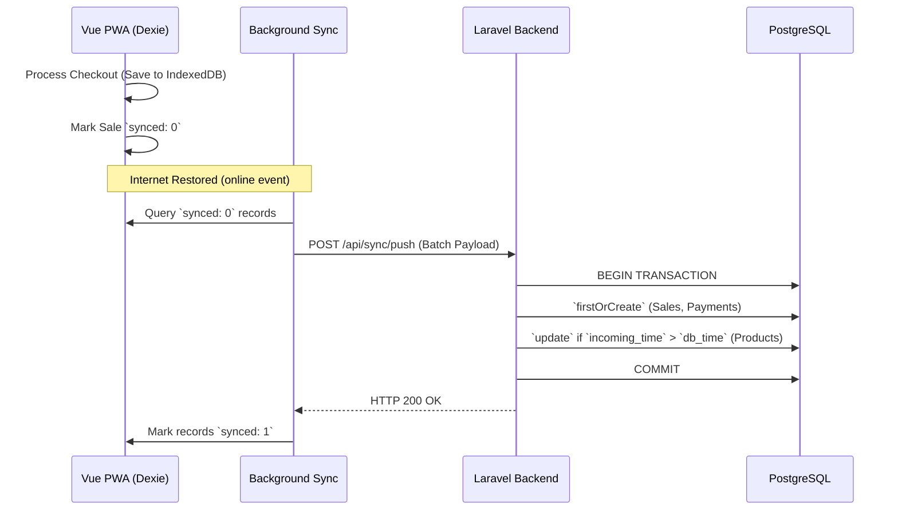

# 🏪 Offline-First Enterprise POS & Procurement System


An enterprise-grade, offline-first Point of Sale (POS), Inventory, and Procurement Progressive Web App (PWA) designed specifically for retail environments with unreliable internet connectivity.

Built with **Vue 3**, **Pinia**, and **Dexie.js (IndexedDB)** on the frontend, powered by a headless **Laravel REST API**, this system guarantees zero data loss during network outages while providing a sub-second, native-app-like checkout experience.

---

## 🏗️ Architectural Highlights

This project solves the hardest problem in retail software: **maintaining distributed data integrity across multiple devices with intermittent connectivity.**

### 1. True Offline-First Resilience
The application does not block the UI waiting for network requests. All reads and writes occur against a local IndexedDB instance (via Dexie.js). Background synchronization is managed natively via browser `online/offline` event listeners and Workbox Service Workers, allowing a shop to operate for days without an internet connection.

### 2. Deterministic Conflict Resolution
Syncing distributed data relies on a hybrid conflict-resolution engine using UUIDv4 primary keys generated on the edge device:
*   **Append-Only Ledgers (Conflict-Free):** Transactions like Sales, Stock Adjustments, Credit Repayments, and Shifts are immutable. They are pushed to the server using `firstOrCreate` logic inside strict Database Transactions to prevent duplication.
*   **Last-Write-Wins (LWW):** Mutable entities like Products, Customers, and Suppliers use an `updated_at` timestamp comparison. The server only accepts the payload if the edge device's timestamp is newer than the central database.

### 3. Native Hardware Integration in the Browser
No native drivers required. The system features a custom Vue Composable that intercepts rapid alphanumeric keystrokes globally. Using a sub-50ms debounce buffer, it accurately differentiates between human typing and a physical USB/Bluetooth laser barcode scanner, instantly routing scanned data to the cart.

---

## 🚀 Core Modules

### 🛒 Point of Sale & Checkout
*   **Sub-Second Operations:** Real-time cart calculation (Subtotal, Tax, Change Due) running entirely client-side.
*   **Payment Routing:** Support for Cash, Card, and Store Credit (Khata) checkouts.
*   **Receipt Engine:** Dynamically generated printable receipts formatted for thermal POS printers.
*   **Refunds & Voids:** Automated stock restoration and credit-balance reconciliation for voided sales.

### 📦 Inventory & Procurement (B2B)
*   **Ghost-Stock Prevention:** Direct stock edits are disabled. All inventory changes flow through an append-only `inventory_movements` ledger (Restocks, Damages, Shrinkage) to maintain a perfect audit trail.
*   **Procurement Pipeline:** End-to-end Purchase Order (PO) generation. Receive POs to automatically increment stock and increase Supplier Debt balances.
*   **Supplier Payments:** Track accounts payable and log cash payments to distributors.

### 👥 CRM & Micro-Finance (Store Credit)
*   **"Khata" System:** Deeply integrated customer tabs. Allow trusted customers to checkout via credit, increasing their debt balance.
*   **Debt Repayment Ledger:** Dedicated flow to log cash repayments against customer debt, ensuring cash-drawer accuracy.

### 📊 Cash Management & Analytics
*   **Shift/Z-Reports:** Blind cash-drawer balancing. Cashiers input Opening Float, the system tracks Expected Cash (Float + Cash Sales - Refunds), and calculates Overage/Shortage upon shift close.
*   **Edge Dashboard:** Offline-capable dashboard rendering Daily Sales, Payment splits, and Low Stock (&lt;5 units) alerts from the local database.

---

## 🛠️ Technology Stack

### Frontend (SPA / PWA)
*   **Framework:** Vue 3 (Composition API, Plain JavaScript)
*   **State Management:** Pinia
*   **Local Database:** Dexie.js v5 (IndexedDB wrapper)
*   **Styling:** Tailwind CSS
*   **PWA Engine:** Vite PWA Plugin (Workbox)
*   **Network:** Axios

### Backend (Headless API)
*   **Framework:** Laravel (Latest)
*   **Authentication:** Laravel Sanctum (Token-based)
*   **Database:** PostgreSQL (UUID architecture)
*   **Data Integrity:** DB::transactions for all sync endpoints

---

## 🔄 The Sync Engine Flow



---

## 💻 Local Installation

### Prerequisites
- PHP 8.2+
- Composer
- Node.js 20+
- PostgreSQL / MySQL

### Backend Setup
```bash
# Clone the repository
git clone https://github.com/yourusername/pos-pwa.git
cd pos-pwa

# Install PHP dependencies
composer install

# Environment setup
cp .env.example .env
php artisan key:generate

# Configure your .env database credentials, then run:
php artisan migrate --seed
```

### Frontend Setup
```bash
# Install NPM dependencies
npm install

# Run the Vite development server
npm run dev
```

> **Note on Service Workers:** To test offline capabilities locally, you must build the frontend (`npm run build`) and serve it via `npm run preview`, as Service Workers are generally disabled in standard Vite dev mode.

---

## 🔒 Security & Data Integrity
- **Token Revocation:** Sanctum tokens are cleared locally and remotely on logout.
- **Database Migrations:** Dexie schema updates utilize strict versioning (`db.version(x)`) to silently upgrade edge devices without wiping local storage.
- **Route Protection:** PWA Service Workers are configured to serve static assets via CacheFirst while enforcing a strict NetworkOnly policy for all `/api/*` routes to prevent stale API responses from corrupting Dexie state.

---

*Architected and developed as a modern solution for emerging-market retail.*
